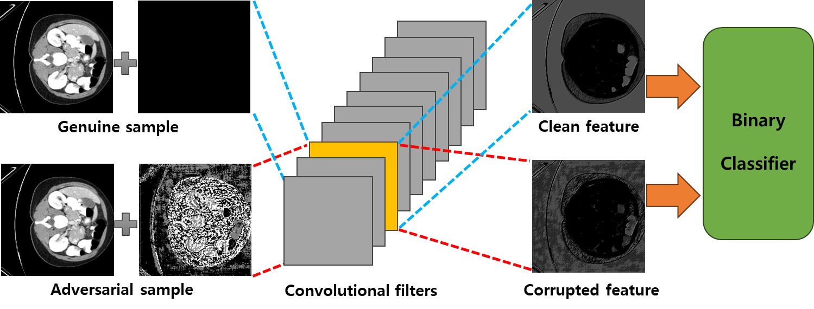
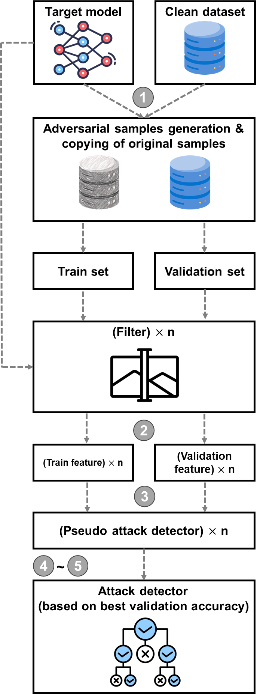
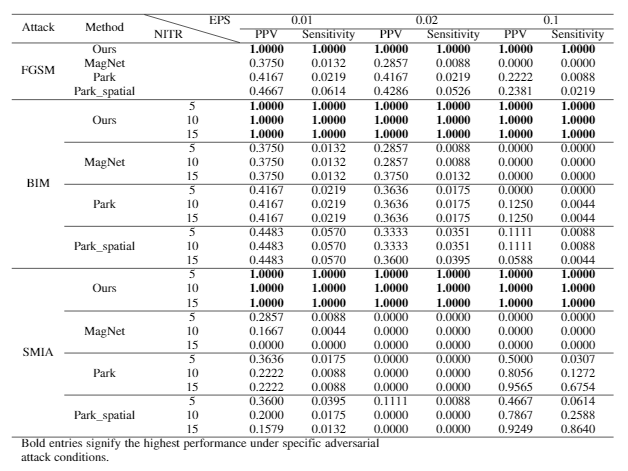
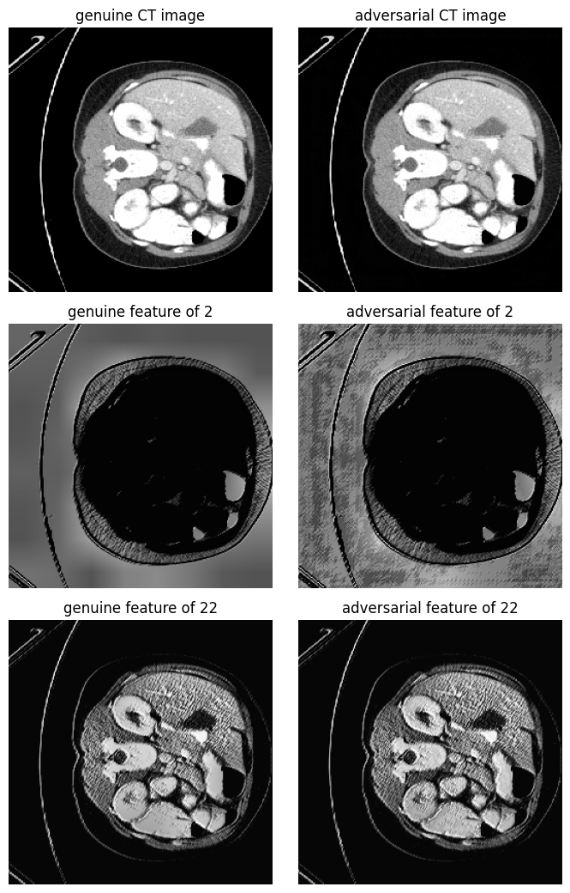
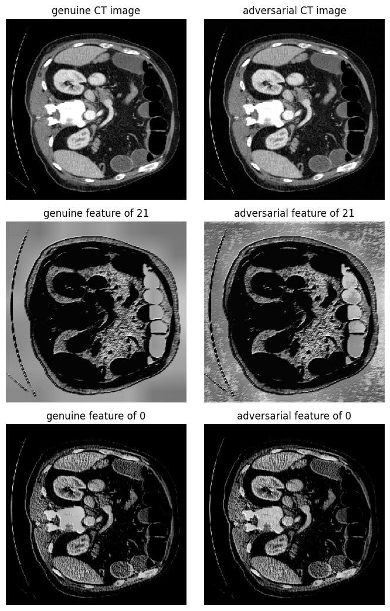
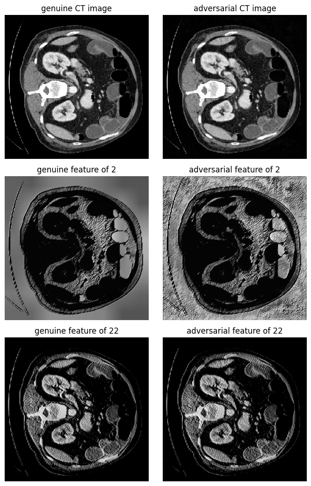

# Enhancing CT Segmentation Security against Adversarial Attack: Most Activated Filter Approach

**Description**: A novel framework for the detection of adversarial samples in convolutional layer-based CT segmentation models.

## Abstract
In this study, we introduce a deep learning-based framework for detecting adversarial attacks in CT image segmentation within medical imaging. Our methodology includes analyzing features from various layers, particularly focusing on the first layer, and utilizing a convolutional layer-based model with specialized training. The framework is engineered to differentiate between tampered adversarial samples and authentic or noise-altered images, focusing on attack methods predominantly utilized in the medical sector. A significant aspect of our approach is employing a random forest algorithm as a binary classifier to detect attacks. This method has shown efficacy in identifying genuine samples and reducing false positives due to Gaussian noise. Our contributions include robust attack detection, layer-specific feature analysis, comprehensive evaluations, physician-friendly visualizations, and distinguishing between adversarial attacks and noise. This research enhances the security and reliability of CT image analysis in diagnostics.

## Methods
<p align="center">

</p>
<p align="center">

</p>

1. **Producing adversarial samples using the target model and a clean dataset:** In the beginning, we utilize the provided target model and clean dataset to create adversarial samples through a recognized attack technique. After generating these samples, they are partitioned into training and validation datasets based on subjects.

2. **item Feature extraction from target model filters:** In the next step, we process the training and validation datasets through the target model, extracting features from each filter in its first layer. Essentially, these features will serve as the input to our classifier, capturing unique characteristics of each image. The features are important because they contain patterns that help to differentiate between legitimate and adversarial inputs.

3. **Classifier training for each filter:** Once we have the feature sets, we proceed to train individual classifiers for each filter using the extracted features from the training set. This is performed to learn the mappings from features to labels (adversarial or not) for each filter. The classifiers could be any machine learning models suitable for binary classification, such as Random Forests, Decision Trees, or Support Vector Machine.

4. **Identifying the most discriminative filter:** After training the classifiers, the next step is to evaluate their performance on the validation set. Our primary aim is to identify the filter that is most effective at distinguishing between genuine and adversarial inputs. We are particularly interested in filters that produce \textbf{a high mean and low variance in their classification scores across the validation set}, as these filters are the most reliable and stable for detection.

5. **Building the final adversarial attack detector:** Armed with the most discriminative filter identified in the previous step, we proceed to build the final adversarial attack detector. We train this detector using both the training and validation datasets. This comprehensive training allows the detector to generalize well to unseen data, effectively identifying adversarial attacks while minimizing false positives and negatives.


## Settings
* TODO: PATH SETTINGS
* 
## Usage
* For training attack detector using random forest against FGSM with eps 0.01, 
```
python adv-classifier-optimization-sklearn.py --attack_name 'fgsm' --gpu 0 --eps 0.01 --classifier 0
```

## Dataset
* This work utilizes "Multi-Atlas Labeling Beyond the Cranial Vault - Workshop and Challenge" (BTCV) which is publicly available at https://www.synapse.org/#!Synapse:syn3193805/wiki/217789

## Results
* We present a side-by-side comparison of PPV and sensitivity among various methods in the table below. As the nature of PPV and sensitivity, higher values for these metrics are preferable. A low PPV suggests that the method is prone to incorrectly labeling genuine samples as adversarial, while low sensitivity implies the method may fail to identify adversarial samples. As the table reveals, our approach outperforms all other methods in both PPV and sensitivity across every configuration. Notably, our method achieves a flawless PPV and sensitivity scores in all scenarios. 

<p align="center">

</p>

* We display some genuine samples alongside their adversarial versions as below. For additional visual comparisons of features from the first layer between genuine and adversarial samples, showcasing the most and least sensitive filters, please visit the provided link! (https://github.com/hyerica-bdml/adv_detection_ct_segmentation/tree/master/figures/visualization)

  * Visualization under FGSM attack <p align="center"></p>
  * Visualization under BIM attack <p align="center"></p>
  * Visualization under SMIA attack<p align="center"></p>


## Citation
If you find this code useful for your research, please cite the paper:
```
@article{lee2024enhancing,
  title={Enhancing CT Segmentation Security against Adversarial Attack: Most Activated Filter Approach},
  author={Lee, Woonghee and Kim, Younghoon},
  journal={Applied Sciences},
  volume={14},
  number={5},
  pages={2130},
  year={2024},
  publisher={Multidisciplinary Digital Publishing Institute}
}
```
